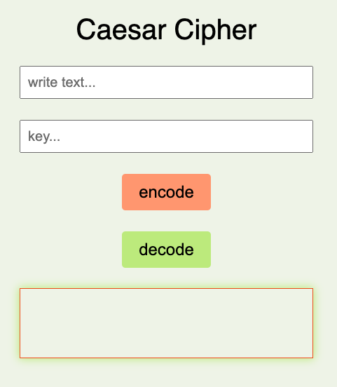
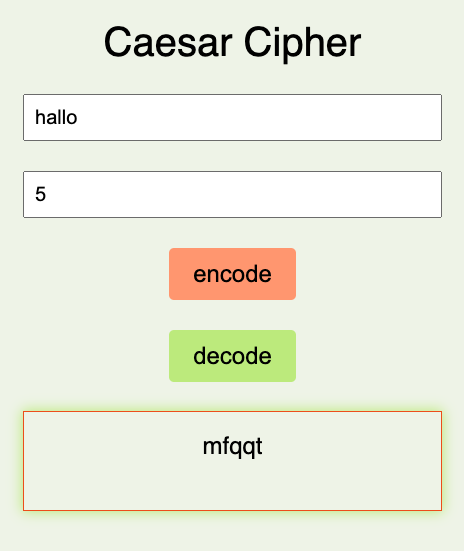

# Ceasar Cipher

- The Ceasar Cipher helps you to encrypt and decrypt your text.
- With this project I have learned to combine and use different loop and string methods.

## Demo

https://cecilestaller.github.io/js-project-caesarCipher/

## Screenshots

## Tech Stack

- HTML5
- CSS
- JavaScript

## Authors

- [@cecilestaller](https://github.com/cecilestaller)
